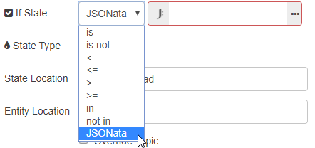

# JSONata Examples 2 - Current State

The Current State node has several opportunites to use JSONata. This example demonstrates all of these, using a node to fetch the current state of a climate air-conditioning unit.

The node default output values include setting msg.payload to the _state_ (which will be "off", "heat", "cool" or more, depending on the integration) as well as msg.data to the entire _entity data object_. This hold values for the last changed timestamp, and attributes such as the friendly name and other integration dependent settings.


Here are three examples, looking at using JSONata to build output properties, to perform If-State conditional tests, and to provide calculated values for UI settings.

@[code](@examples/cookbook/jsonata-new/current-state.json)

### Creating output properties

Build an output message property.


### Generating UI field setting values

Calcuate a setting value in place of a literal.

### Providing a conditional test value

The entity state nodes provide a _conditional test_ opportunity, which can be used to direct the message output one of two ways, depending whether the entity state passes or fails the condition.

When the "If State" option is chosen with a _conditional_ (not JSONata) the condition expects a _value_ to test against. Using JSONata on the right hand side will return the value of the evaluated expression to be tested against the conditional chosen.


In this example, the entity returns**

### Conditional test (Boolean)

When the "If State" option is chosen with _JSONata_, then the right hand side must be a JSONata expression that returns a Boolean value of either true or false. When true the "If State" test is successful, when false the test fails.

The JSONata at this point can be extensive, using `$entity()` to read details from the current node entity, or `$entities()` to read any entity available.




### 

### OR conditional for the events: state node

The trigger-state node is great if you have several conditions you want to check for but it doesn't allow you to use OR checks. Using a JSONata expression with an event:state node will allow you to fill this gap.

Motion sensor at the front door triggers and have a text to speech notification be sent if at least one person is home.

```json
$entity().state = "on" and (
   $entities("person.person1").state = "home" or $entities("person.person2").state = "home"
)
```