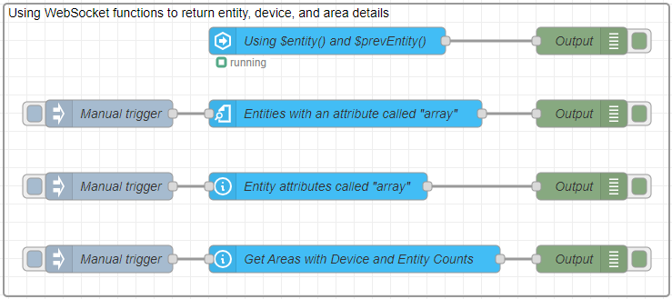

# JSONata Example 8 - Using the WebSocket functions

Several additional **JSONata functions** are provided for use within the WebSocket nodes. JSONata expressions are first 'prepared' then 'executed', and the first preparation stage is used to bind the expression to extra Node-RED or other functions. This means that these WebSocket functions can **only** be used within a WebSocket node.




This example demonstrates the basic use of some of these functions.

@[code](@examples/cookbook/jsonata-examples/ws-functions.json)


### Reading entity state and attributes with _$entity()_ and _$prevEntity()_

In nodes with _output properties_, some properties are typically set by default, or can be set as:

- msg.payload = 'entity state'
- msg.data = 'entity'
- msg.event = 'event data'
- msg.topic = 'entity id'

This provides useful message values in the flow _following_ the node, however these values can be obtained within the node itself using the appropriate functions.

`$entity()` returns an object containing the entity details, relating to the entity that is the subject of the node. This means that:

- 'entity' = $entity()
- 'entity state' = $entity().state
- 'entity id' = $entity().entity_id

For the **Events:** nodes (Events: all and Events: state) the node triggers from an event change, with _$entity()_ being the current (new) entity details, and the function `$prevEntity()` being the previous (old) entity details.

```json
{"old": $prevEntity(), "new": $entity()}
```

The first example uses an Events: state node, with a basic sensor.time node to facilitate triggering the node every minute. The [Time & Date Integration](https://www.home-assistant.io/integrations/time_date/) should be added to the configuration file, and then the time sensor will return the current local time. The entity state (time) is "hh:mm" and therefore changes every 60 seconds.

The output _msg.payload_ is set to a new JSONata expression, which creates a new object with the old and new entity details, just as 'event data' would do, but permitting a more detailed JSONata expression to be executed.

### Using _$entities()_ to return any or all entities

The next two examples explore ways to obtain specific entities, and this code specifically looks for all Home Assistant entities that have an attribute field called 'array'.

```json
$entity().attributes.array!=[]
```

In the first flow, a _Get Entities_ node is used, with JSONata expression used to filter the result, based on each entity having an attribute field called 'array' that is a non-empty JSON array. This will return the entire entity, and therefore the output will be an array of entities that have an 'attribute.array' field.

```json
$entities().*.attributes[$exists(array)]
```

In the second flow, a _Current State_ node is used, with any valid entity. The return from the entity itself is not required - the node is just being used as a vehicle in which to execute the _$entities()_ function. When specifying a specific entity `$entities('sun.next_dawn')` only that entity will be returned, otherwise an array of all entities in Home Assistant will be returned. This JSONata expression then matches any entity, filtering out attributes fields where an object key 'array' exists.

In contrast to the preceeding flow, this will return just an array of the entity attribtues. The JSONata code in this case can be executed just as and when required.

### Using _$areas()_, _$areaDevices_ and _$areaEntities()_

Here a more complex JSONata expression returns details about areas, devices, and entities.

```json
$areas()^(name).{
    name: " Devices: " & $count($areaDevices(area_id)) & " Entities: " & $count($areaEntities(area_id))
    } ~> $merge()
```

The JSONata is just one long expression line. Evaluated left to right, it starts with the `$areas()` function.
- without a given area lookup value, the function returns an array of all areas in Home Assistant
    - this is then sorted alphabetically, by name
- the result is an array, which is mapped (iterated over)
- applying an {} object constructor for each array item
    - the object creates one key: value pair
    - the area 'name' is the key (this is a string)
    - a text string is contructed for the value
- the function $areaDevices(area_id) returns all devices in that area
    - using 'area_id' for the item area, and returning an array of devices
    - using $count() to count the number of devices in the returned array
- the function $areaEntities(area_id) returns all entities in that area
    - returning an array, which is similarly counted
- the resulting array of objects is then merged into one object

