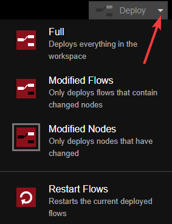
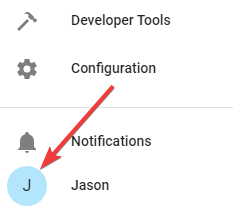
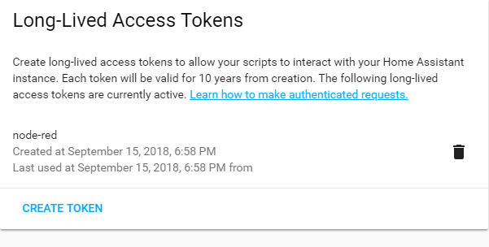

# Getting Started

## Prerequisites

Have Node-RED installed and working, if you need to
install Node-RED see [here](https://nodered.org/docs/getting-started/installation).

- [Node.js](https://nodejs.org) v8.12 or newer
- [Node-RED](https://nodered.org/) v0.19 or newer

## Installation

### Using the Palette Manager

Search in the [Palette
Manager](https://nodered.org/docs/user-guide/editor/palette/manager) for:

```
node-red-contrib-home-assistant-websocket
```

### Using npm from the command line

```bash
$ cd ~/.node-red
$ npm install node-red-contrib-home-assistant-websocket
# restart Node-RED
```

### Hass.io

The Community Hass.io add-on ships with this node right out of the box. Under the server node config check the checkbox for `I use Hass.io`.

The add-on can be found here: <https://github.com/hassio-addons/addon-node-red#readme>

## Configuration

Place an Events: all node onto the workspace and edit the node. Click on the
pencil icon next to the Server field.


Fill in the Base Url and Access Token on the server config node then Add/Update the
Server Config and Events: all nodes and deploy. After deploying a green box with
a status message, i.e. connected, stated_changed, should appear below
the Events: all node. If you see an open box with the status of connecting or
disconnected you probably have incorrectly entered the base URL or access token.

- **Base Url** is the web address and port you use to access the Home Assistant frontend (e.g.,
  http://localhost:8123, http://192.198.x.x, and http://example.duckdns.org).

- **Access Token** is generated in Home Assistant there are [instructions below](#generating-access-token) on how to
  generate one.

::: tip
Changing the deploy type to Modified Flows or Modified Nodes will make it so when
you deploy only the flows that you have modified will get reloaded. This helps
if you have other flows on the workspace that you don't want to have reloaded
everything time you change something else.


:::

::: tip
If you find that new entities added to Home Assistant are not showing up in the
autocomplete results try unchecking `Cache Autocomplete Results` in the
server config and restarting Node-RED.
:::

### Generating Access Token

Goto your Home Assistant home page and in the bottom left corner click on the blue circle with the letter in it. In the screenshot below it's the "J".



Scroll down to the bottom of the page and it should look like the screenshot
below and click on the Create Token Button. Give it a name, it can be anything you
want to identify it with. Copy the generated access token into Node-RED.



::: tip
Creating a separate Home Assistant user for Node-RED and using their access token will give you the
ability to track which entities where changed by Node-RED.
:::

## Migrating

Coming from a different version, e.g. [@Ayapejian](https://github.com/AYapejian/node-red-contrib-home-assistant) or [@Spartan-II-117](https://github.com/Spartan-II-117/node-red-contrib-home-assistant-llat)?

If you have been using
[@Ayapejian](https://github.com/AYapejian/node-red-contrib-home-assistant)
version there are some breaking changes with two of the nodes. The [poll state](./node/poll-state.md)
and [current state](./node/current_state.md) both have a little different formatted outputs. Check your nodes
and make sure they are outputting what you expect. A more in-depth example can
be found
[here](./migration.md).

If you have been using the [@Spartan-II-117](https://github.com/Spartan-II-117/node-red-contrib-home-assistant-llat) fork this should be a drop-in replacement.
